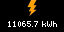

# SolarTidbyt
Works with the SolarEdge inverters via the [SolarEdge API](https://www.solaredge.com/sites/default/files//se_monitoring_api.pdf), specifically the Overview API.

## Data Shown
* Lifetime energy produced in kWh
* Pounds of C02 equivalent
* Acres of forest to absorb that amount of Co2

### Example Display

## Data Conversions
### kWh -> CO2
The KWh to CO2 conversion is calculated as 0.92 pounds of CO2 per KWh as seen via the [U.S. Energy Information Administration FAQ](https://www.eia.gov/tools/faqs/faq.php?id=74&t=11).

### CO2 -> Acres of Trees
The Pounds of CO2 to Acres of Trees conversion is calculated as 0.77 metric tons of CO2 absorbed per acre per year as seen via the [EPA Greenhouse Gases Equivalencies Calculator - Calculations and References](https://www.epa.gov/energy/greenhouse-gases-equivalencies-calculator-calculations-and-references). 

I'm a little worried I have this calculation wrong. 
My calculation is...
* `0.77 mt/acre/year * total_year_diff years = M mt/acre (lifetime)`
* `1/(M mt/acre) = A acre/mt`
* `(A acre/mt) * mt = T total acres`
* So... `(1/(0.77*total_year_diff))*co2_metric_tons = total acres`.

I think

## Deploying to your Tidbyt
_This will be filled out once I have a Tidbyt and know how to do this...._
