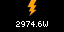

# SolarTidbyt
Works with the SolarEdge inverters via the [SolarEdge API](https://www.solaredge.com/sites/default/files//se_monitoring_api.pdf), specifically the Overview and Site Info APIs, to display information on a [Tidbyt](https://www.kickstarter.com/projects/tidbyt/retro-display)

## Data Shown
* Current energy generating in Watts
* Metric Tons of C02 equivalent
* Acres of forest to absorb that amount of Co2
* Blank frame [to get around an [issue when published to a Tidbyt](https://discuss.tidbyt.com/t/entire-webp-file-loop-not-publishing-to-tidbyt/1336/5) that the last frame is truncated from displaying.]

### Example Display

## Data Conversions
### kWh -> CO2
The KWh to CO2 conversion is calculated as 0.92 pounds of CO2 per KWh as seen via the [U.S. Energy Information Administration FAQ](https://www.eia.gov/tools/faqs/faq.php?id=74&t=11). Then multiply that by 0.000453592 to get Metric Tons [per Google](https://www.google.com/search?q=convert+pounds+to+metric+tons&oq=convert+pounds+to+metric+tons&aqs=chrome..69i57j0l2j0i22i30l7.4026j1j7&sourceid=chrome&ie=UTF-8).

### CO2 -> Acres of Trees
The CO2 to Acres of Trees conversion is calculated as 0.77 metric tons of CO2 absorbed per acre per year as seen via the [EPA Greenhouse Gases Equivalencies Calculator - Calculations and References](https://www.epa.gov/energy/greenhouse-gases-equivalencies-calculator-calculations-and-references). 

I'm a little worried I have this calculation wrong. 
My calculation is...
* `0.77 mt/acre/year * total_year_diff years = M mt/acre (lifetime)`
* `1/(M mt/acre) = A acre/mt`
* `(A acre/mt) * mt = T total acres`
* So... `(1/(0.77*total_year_diff))*co2_metric_tons = total acres`.

I think

## Deploying to your Tidbyt
I'm running a cron job on a Raspberry Pi that calls a script. The script does the following:
1. Runs `$ pixlet render solarlife.star`
2. Runs `$ pixlet push ......`

Running once every 5 minutes so that current data generation is relatively up to date.

### SolarEdge data on Twitter?
See my other project, [solar3](https://github.com/jasondborneman/solar3)!
